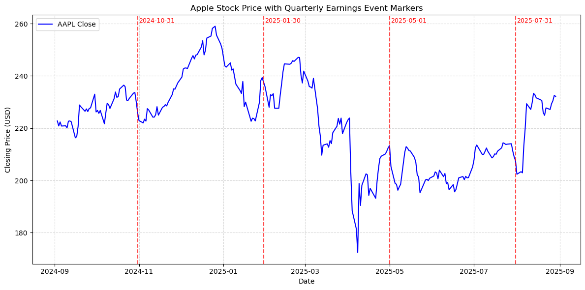
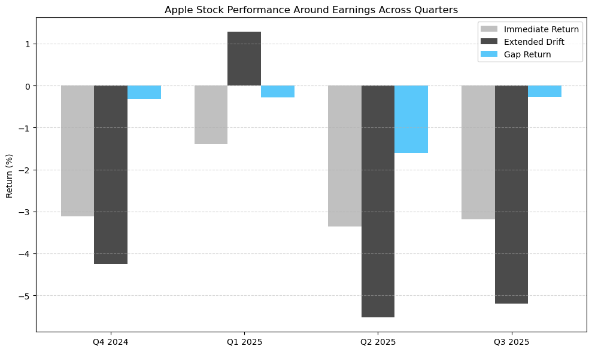

# Apple-stock-reactions-to-Quarterly-Earnings-reports
## Project Objective
This project analyzes the impact of Apple’s quarterly earnings reports on its stock price using historical market data from the Financial Modeling Prep (FMP) AP.
 The goal is to quantify and visualize market reactions using historical stock data.

---

## Data
- **Stock Prices:** Daily historical data from the [Financial Modeling Prep (FMP) API](https://financialmodelingprep.com/)  
- **Earnings Dates:** Verified from Apple’s official newsroom and FMP API  
- **Event Window:** ±3 trading days around each quarterly earnings date  

> **Note:** All data is publicly available and used here for educational purposes.

---

## Methodology

1. **Event Identification:** Last four Apple quarterly earnings dates:
   - Q4 2024: 2024-10-31  
   - Q1 2025: 2025-01-30  
   - Q2 2025: 2025-05-01  
   - Q3 2025: 2025-07-31  

2. **Event Window Creation:** ±3 trading days around each event.  

3. **Metrics (North Star Metrics):**
   - **Immediate Return (%):** Price change from t-1 to t+1  
   - **Extended Drift (%):** Price change from t-3 to t+3  
   - **Gap Return (%):** Overnight change between event day open and previous close  

4. **Visualizations:**  
   - Time-series plot with vertical markers for earnings events  
   - Bar chart comparing Immediate Return, Extended Drift, and Gap Return across quarters  

---

## Key Findings

| Quarter | Immediate Return % | Extended Drift % | Gap Return % |
|---------|-------------------|------------------|---------------|
| Q4 2024 | -3.12             | -4.26            | -0.33         |
| Q1 2025 | -1.40             |  1.28            | -0.29         |
| Q2 2025 | -3.36             | -5.53            | -1.61         |
| Q3 2025 | -3.19             | -5.20            | -0.27         |

**Observations:**  
- Most quarters show a negative immediate market reaction to Apple’s earnings, indicating that stock prices generally fell on or around the earnings release.
- The extended drift is also mostly negative, suggesting that the short-term trend continued downward after the event.
- Gap returns are relatively small but generally negative, showing modest overnight price changes following the earnings announcements.
Overall, these results suggest that these particular quarters were viewed cautiously or negatively by the market.  

---

## Visualizations

### Time-Series Plot
Shows Apple stock closing price over time with vertical markers indicating quarterly earnings events.


### Bar Chart
Compares Immediate Return, Extended Drift, and Gap Return for all four quarters.


---

## How to Run
1. Clone the repository:  
```bash
git clone https://github.com/yourusername/apple-earnings-analysis.git
